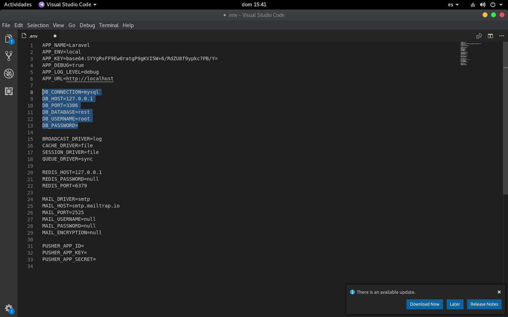

# Proyecto : RESTfulAPI con LARAVEL / project : RESTfulAPI with LARAVEL

## *DESCRIPCIÓN DEL PROYECTO / PROJECT DESCRIPTION:*

Proyecto REST realizado con fines academicos y para quienes deseen aprender como hacer un CRUD basico con LARAVEL mediante REST.

*Project REST was made academic objectives and for who wants to learn how to implement CRUD in LARAVEL through REST.*

## Tecnologías usadas / technologies used:

- PHP 7.2
- Composer.
- LARAVEL 5.4
- MYSQL ( támbien puede usar Pgsql and SQLserver / Also can uses Pgsql and SQLserver). 
- JSON/XML.
- POSTMAN ( para probar funcionalidad del servicio / for try out functionality of services).

## Contenido del proyecto / Project content : 
- 2 Tablas en base de datos/  2 tables in database (Clientes,Transacciones).  
  - Ruta/Route:
    ~~~
      database/migrations/      create_Clientes_table.php     create_Transacciones_table.php
    ~~~
- 2 modelos / 2 models (Clientes , Transacciones).
  - Ruta/Route:
    ~~~
      App/Clientes.php    App/Transacciones.php
    ~~~
- 2 controladores / 2 controllers (ClientesController , TransaccionesController).
  - Ruta/Route:
    ~~~
      App/http/Controllers/ClientesController.php    App/http/Controllers/TransaccionesController.php
    ~~~
- Archivo de rutas  / File routes:
  ~~~
    routes/api.php
  ~~~
  
## Configurar BD / Configure DB : 
   Ruta/Route:
  ~~~
    /.env
  ~~~ 
Editar las especificaciones resaltadas con la informacion de su base de datos (mysql , pgsql , sqlserver).

*Edit highlighted specifications with information of your database (mysql,pgsql,sqlserver)*.

### Migrar BD / Migrate DB:

Al configurar y crear su bd en cualquiera de las plataformas nombradas en el punto anterior , debe abrir su terminal de comandos y ubicarla en la carpeta raíz de su proyecto.

After configure and create your db in any platform previously named , open your command terminal in the route of project.

Escriba el siguiente comando / write next command: 

`$ php artisan migrate`

Si tiene problemas al hacer la migración , por favor siga la siguiente documentación : https://laravel.com/docs/5.4/migrations

If have problems with migrate , please follow this documentation:  https://laravel.com/docs/5.4/migrations

## Como usar / how use : 

  - Crear Cliente / Create Client : 
    - Metodo/methos:  **POST**
    - Ruta / Route :  <your localhost>/clientes
    
      
